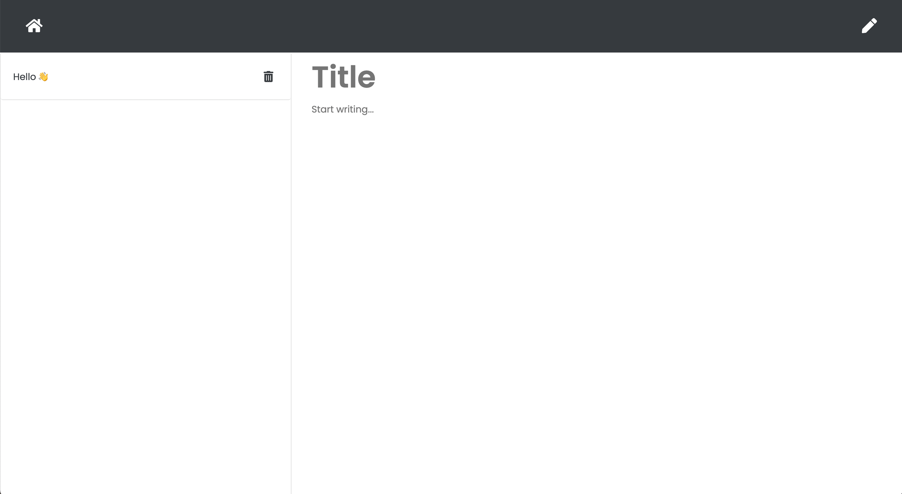

# Note Taker
A mini application that allows you to take and save notes | Deployed in Heroku (server hosting platform)

## Deployment

In order to deploy the application you will have to execute it in node by opening it up in ther terminal and typing 'node server.js' after installing the packages. 

Application: [Note Taker](https://secure-peak-10243.herokuapp.com/)

## Why make this?
Never lose track of your thoughts! This application allows you to jot down your ideas while keeping them backed up in a database.

## My goal
This is the first time that I've hosted an application on my own personal backend servers. My goal was to have the front and back end work together seamlessly. I used express.js to write my server code and created a JSON file that saves all the data.

## Running the application

First you will have install the npm packages from the json file by running 'npm install'. Then will need to run 'node server.js' in ther terminal to host the server localally. Go to 'localhost:3000' to see the application.

## Landing Page

The is the first page you will land on. The design is very simple as I was more focused on the back-end.

## Adding Notes

You are able to create as many notes as you like and delete them.

## End note
I hope you enjoyed going through my application and hopefully you will be able to save some notes 👍
